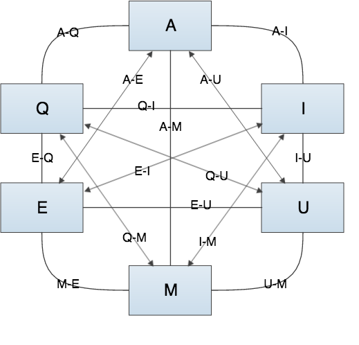
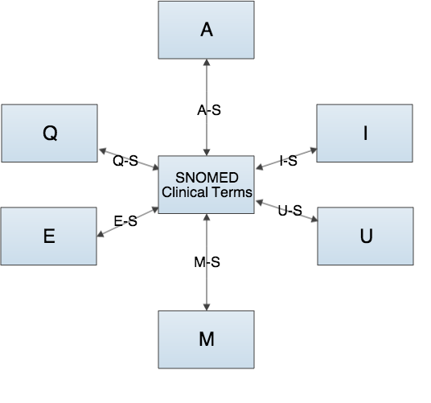

# 12. Mapping

This section provides an overview of:

  * Mapping approaches
  * How SNOMED CT represents maps
  * Steps in a mapping process

## Why is this important?

Clinical information recorded using SNOMED CT may include data that is relevant to reports, statistical returns, billing claims, etc. that need to be encoded using a specific code system or a statistical classification such as ICD-10. Mapping allows relevant information to be used for those purposes, minimizing the requirement for additional manual data entry.

Organizations planning to implement SNOMED CT based solutions may also be faced with data transformation and migration challenges which lead them to consider mapping their existing clinical data, code systems or classifications to SNOMED CT.

As a common global reference terminology, SNOMED CT limits the need for development of "everything to everything" maps between multiple different code systems.

**Problem: Map Everything to Everything**  
|  |    
  
**Solution: Map to a SNOMED Clinical Terms**  
|  |    
  
  

## What is this?

Maps are associations between particular codes, concepts or terms in one code system and codes, concepts or terms in another code system that have the same (or similar) meanings. Mapping is the process of defining a set of maps. Maps are developed in accordance with a documented rationale, for a given purpose and as a result there may be different maps between the same pair of code systems to meet different uses cases.

There are a number of different types of mapping activities that an organization may need to undertake. These include mapping:

  * SNOMED CT to a statistical classification (such as ICD-10)
  * Classifications to SNOMED CT
  * Other standard code systems to or from SNOMED CT
  * Locally developed code systems to SNOMED CT
  * Locally collected clinical data documented as free text to SNOMED CT

The completeness of mapping between two code systems depends on the scope, level of detail provided by the two schemes and the precision of mapping required to safely meet the intended mapping use case.

### Mapping Approaches

The approaches used when undertaking mapping include human mapping, automatic mapping or a combination of both of these.

Automatic mapping is when computer algorithms are used to create maps between concepts and or terms - for example between local clinical content and SNOMED CT. Lexical mapping, where the structure of the words in the clinical term is compared and analyzed as to whether the words are the same, similar or different, is often incorporated within automatic mapping. Significant care must be taken with automatic mapping, because severe mapping errors can result if not done in a controlled way. Automatic mapping, in conjunction with human review (and manual remapping where necessary), is likely to achieve better results than automatic mapping alone.

Human mapping is the use of human knowledge and skill to author maps. Each map is built singly and individually. The process requires examination of each and every concept in the coding system. Informed judgments or decisions are made about the shared meaning of concepts. Electronic or computational tools are used, but only in support of work process.

### How SNOMED CT Represent Maps

SNOMED CT specifications and content include resources that support mapping to and from other code systems, classifications and terminologies. These resources support simple, complex and extended mappings. Simple maps, where there is a one-to-one Relationship between a SNOMED CT concept and code in a target scheme, are represented using a Simple Map Reference Set. Complex and Extended Map Reference Sets enable the representation of:

  * Maps from a single SNOMED CT concept to a combination of codes (rather than a single code) in the target scheme.
  * Maps from a single SNOMED CT concept to choice of codes in the target scheme. In this case, the resolution of the choices may involve:
    * Manual selection supported by advisory notes.
    * Automated selection based on rules that test other relevant characteristics in the source data (e.g. age and sex of the subject, presence or absence of co-existing conditions, etc.).
    * A combination of automated processing with manual confirmation or selection where rules are insufficient to make the necessary decisions.

### Steps in a Mapping Process

The main steps to be completed and documented when completing a mapping process include:

  * Evaluate mapping as a solution
  * Produce mapping requirements
  * Develop and review the maps
  * Use the maps
  * Review activity

#### Evaluating Mapping as a Solution

When approaching the creation of a map, the first step is to understand the data which needs to be transformed or migrated and the requirements for use of that data. Key questions to address include:

  * Are the business requirements well understood?
  * Are there other options for meeting the business requirements without mapping?
  * To what extent can the source data contribute value to the target data?
  * What are the options?
  * What requirements are there beyond developing and delivering the maps? (e.g. enabling appropriate use of the maps for data conversion).
  * What is the scope of the mapping exercise?
  * What are the expert resource requirements and costs of creating, quality assuring and maintaining the maps?
  * What are the potential risks arising from using the maps?

#### Produce Mapping Requirements

It is essential to fully understand the structure, content and semantics of both the source and target code systems. It is also important to understand how the meaning of the codes is affected by the structure and functionality of the source and target systems. Once the code system and how it has been used is fully understood, a document should be created which defines the rules to be applied when creating maps to or from SNOMED CT. These rules will address for example, the approach to inexact mappings, the use of synonyms, postcoordinated expressions and others. In order to be able to understand the evolution of the maps, an audit trail of the map creation and maintenance activity should be maintained.

Human resource requirements are dependent on the mapping scale, the model used for mapping and the type and complexity of the map being developed. The roles that may be required could include mapping sponsor, mapping manager, mapping specialist, clinical specialists and a mapping advisory group.

Once all requirements have been defined, appropriate software tools to support the creation of the maps must be decided upon. The tools required depend on the complexity of the map and mapping process. Three main alternatives include the use of simple multipurpose tools like spreadsheets, dedicated map maintenance applications and/or custom built applications.

#### Develop the Map

The process of map development needs to be done in a controlled manner and involves:

  * Data preparation
  * Algorithmic mapping (where possible and deemed to be safe)
  * Human mapping, including map verification
  * Publication
  * Life cycle management

Checks and balances should be used at each stage to ensure that the process is technically accurate and any maps created should be checked either using a map verification process or by parallel independent mapping. Once maps are created and published a cycle of testing should be performed to validate that the results obtained through the use of the maps to transform or migrate data meets the defined requirements.

#### Use the Maps

Having created the maps to or from SNOMED CT, there are various aspects to consider when using the maps to migrate or transform clinical data. The actual specific use case needs to influence the final requirements of how this is undertaken. Specific attention needs to be paid to reporting, interoperability and data migration. The more common use cases are:

  * Identifying records to include in reports.
  * Transforming the original clinical data to meet the messaging specification for sending data to another system.
  * Migrating existing clinical data either because a system is being upgraded to use SNOMED CT or to introduce a new system that uses SNOMED CT.

Throughout the use of maps, there are fundamental principles and best practices that should be adhered to including:

  * Consider all design elements of the system.
  * Maintain an audit trail for transformation or migration.
  * Manage future amendments to the mapping table.
  * Ensure visibility of original text of mapped items (as recorded prior to mapping).
  * Support clinical safety.

#### Review Activity

As with any process, a post-activity review stage is recommended. This should ensure that:

  * Appropriate lessons are learnt and documented and thus can be referred to in any future mapping activity.
  * Issues that can be addressed within the current mapping are appropriately managed. For example, where the maps are being used for transformation then lessons learnt should be fed back into the process to improve the quality of the transformed data. The same is true in a data migration scenario where maps are reapplied subsequent to the initial migration.

