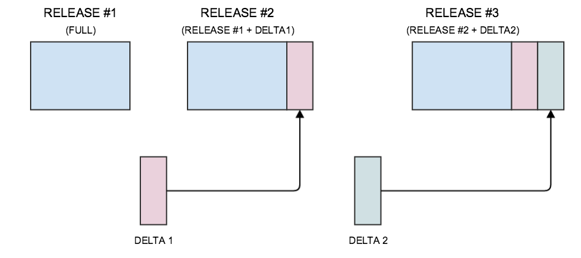

# 13. Release Schedule and File Formats

This section provides an overview of:

  * Release schedule and process
  * Release files and formats
  * Release types

## Why is this important?

SNOMED CT is distributed to Members and Affiliate Licensees as a set of downloadable files. Those wishing to implement SNOMED CT in software applications should understand the release schedule and the structure and content of the release files. Users should be aware that regular updates of SNOMED CT are made available and should be used in their systems to benefit from continuous improvements to coverage and quality.

## What is this?

### Release Schedule and Process

The SNOMED CT International Edition is currently released monthly on the last day of each month. The release files are made available to Members in advance of the formal release date and Affiliate Licensees gain access either through their National Member or via the SNOMED International Affiliate Licensing system. Many Members supplement the International Edition with releases of their national Extension. The Extensions may be released at the same time as the International Edition but in some cases are released on different dates and at different intervals.

### Release Files and Formats

Release Format 2 (RF2) is the primary format used for SNOMED CT release files. This format includes valuable additional data that was not supported by the earlier format.

The SNOMED CT International Edition is released as a set of files:

  * The release files are:
    * Tab-delimited text files
    * Encoded in accordance with the Unicode UTF-8 specification (which supports a wide range of characters, symbols and accented characters)
  * There are individual files with specified columns for each of the core components of SNOMED CT:
    * Concepts
    * Descriptions
    * Relationships

All components in the release files have permanent unique SNOMED CT Identifiers.

  * There are also individual files with specified columns for each type of Reference Set
    * These files contain essential information about language preferences, subsets, maps and metadata to support technical implementations

The same file formats are also used for SNOMED CT Extensions.

### Release Types

The RF2 specification provides a history tracking mechanism within the distributed files. This enables different release types to be provided using the same file format and utilizing this mechanism to optimize installation and updating.

**Full Release:** A 'Full' release contains every version of every component that has ever been released prior to or in the specified Edition. This release provides a full historical record and can be used to obtain views of the state of any component at any point in time since its first release. The 'Full' release is the easiest way to install and initialize SNOMED CT. However the files are large and in each release only a small fraction of the content will have changed.

**Delta Release:** A 'Delta' release contains only those component versions created, inactivated or changed since the previous release. The 'Delta' release is much smaller than a 'Full' release and is ideal for updating a 'Full' release of the previous version. Adding a 'Delta' release to the previous version's 'Full' release will update the installation to a 'Full' release of the current Version. Note that a Delta release is not included as part of the International release but Delta release files can be generated. (See <https://github.com/IHTSDO/delta-generator-tool> for details.)

  
** |  <figure></figure>  
**

**Snapshot Release:** A 'Snapshot' release contains the most recent version of every component released up to the time of the snapshot. The version of each component contained in a snapshot is the most recent version of that component at the release time. The 'Snapshot' release is useful for a simple installation but does not provide a history or retrospective view of the terminology.

There are valid use cases for each Release Type. Each International release will incorporate the Full and Snapshot Release Types, allowing users to choose the most appropriate format for their needs. Extensions should always be available as a full release and other Release Types may also be made available.

### Relationships Between Files

In Snapshot Release files

  * Each SNOMED CT concept is held as a single row in the concept file. Each row represents a clinical concept.
  * Each description is held as a single row in the description file, and is associated with a single concept.
  * Each relationship, from a source concept to a destination concept, is held as a single row in the relationship file. Each row also refers to the concept that represents the relationship type.

In Full Release files, concepts, descriptions and relationships may be represented by more than one row. In this case each row represents the state of the component at a stated point in time.
