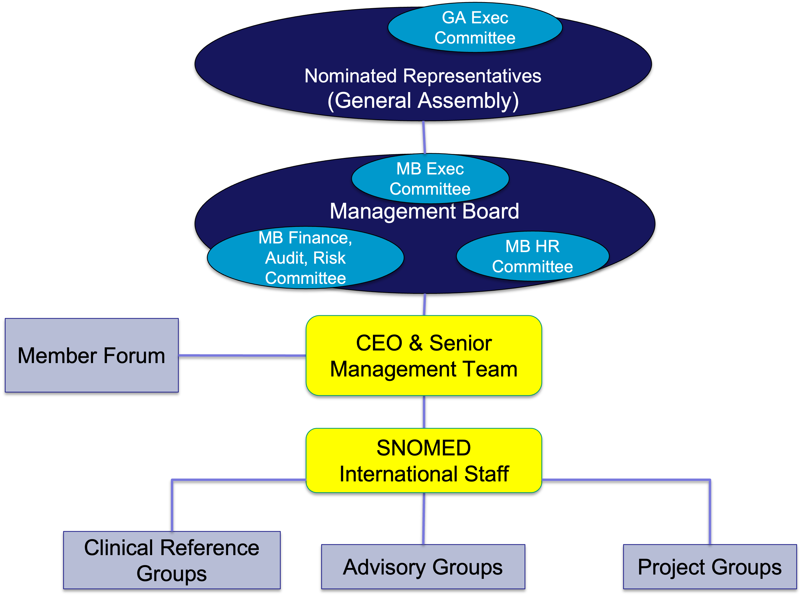

# The Organization Behind SNOMED CT

This section provides an overview of:

* SNOMED International
* Members and National Release Centers
* SNOMED International Forums, Advisory Group and Special Interest Groups
* SNOMED International Collaborative

### Why is this important?

SNOMED International is the not-for-profit organization that owns and administers SNOMED CT, and owns the rights to SNOMED CT and related terminology standards. What is this?

SNOMED International the trading name of IHTSDO is an association governed by a General Assembly that contains one representative of each of its national Members.

SNOMED International seeks to improve the health of humankind by fostering the development and use of suitable standardized clinical terminologies, notably SNOMED CT, in order to support safe, accurate, and effective exchange of clinical and related health information. The focus is on enabling the implementation of semantically accurate health records that are interoperable.

The purpose of SNOMED International is to develop, maintain, promote and enable the uptake and correct use of its terminology products in health systems, services and products around the world, and undertake any or all activities incidental and conducive to achieving the purpose of the Association for the benefits of the members.

The bodies and forums of SNOMED International are the foundation for the continuous maintenance, development and distribution of SNOMED CT, and they provide the organizational framework for communication and collaboration between the different parts of the SNOMED community.

### Members of IHTSDO

SNOMED International current members can be found at the SNOMED International web page ([http://snomed.org/members/](http://snomed.org/members/)). Members can be either an agency of a national government or another body endorsed by an appropriate national government authority within the country it represents. SNOMED International welcomes new Members.

Members pay a fee, based on national wealth, to SNOMED International which gives them the right to a seat on the General Assembly. SNOMED International does not charge Affiliate Licensees for use of the SNOMED CT International Edition within Member countries. Licensing is also free in the poorest countries and for certain approved public-good uses in other countries. In other cases, low-cost per-institution charges apply to the use of SNOMED CT in operational systems involved in data creation and/or analysis. All use of SNOMED CT is subject to the acceptance of the terms of the SNOMED CT Affiliate License agreement ([https://www.snomed.org/get-snomed](https://www.snomed.org/get-snomed)) and the terms of sublicenses issued to end-user organizations by Affiliate Licensees. Members may also impose additional conditions on use of SNOMED CT within their countries. For example, a Member may require licensees to support and include its National Extension in its implementations.

#### National release centers

Members undertake a range of activities related to their involvement in SNOMED International and their role in distributing, extending and supporting the use of SNOMED CT in their country. The organization or agency that coordinates this role in each country is referred to as a National Release Centre (NRC). National Release Centers provide a single point of contact for communications with SNOMED International and other Members. Within their own countries, NRCs manage the use of SNOMED CT and communicate with a range of stakeholders, including SNOMED CT Affiliate Licensees, healthcare institutions, clinical groups and end users.

### Governance

An overview of SNOMED International governance and advisory structures are shown in the following figure.

<figure><figcaption></figcaption></figure>

## General Assembly

The General Assembly is the highest authority in SNOMED International and contains one representative from each of its national Members. The General Assembly is collectively responsible for assuring that the Purpose, Objects and Principles of the Association are pursued and that the interests of SNOMED International are safeguarded. It can make binding decisions regarding all matters relating to SNOMED International, subject to and in accordance with the provisions of the Articles of Association, such as budget, work plan and strategic goals. It is recommended though not required that General Assembly representatives attend all meetings. Face-to-face meetings occur usually twice per year with occasional teleconferences and electronic voting.

## Management Board

The Management Board is appointed by the General Assembly. The Management Board directs the Association and has the responsibility for key business decisions. It has at least four face-to-face meetings per year with occasional teleconferences between these meetings.

The Management Board also appoints the Chief Executive Officer (CEO), who has day-to-day responsibility for running the organization. A Senior Management Team, with members each responsible for a particular line of business, supports the CEO and directs the work of employees.

## Advisory bodies

### Member Forum

Each Member is entitled to nominate two representatives to the Member Forum (MF). The MF acts as a non-voting advisory body to the CEO and Senior Management Team.

The MF is also a means for optimizing the collaboration and coordination among SNOMED International Member countries provides a means for Members to have discussions on specific Member issues. Moreover, the MF facilitates contact and communication between countries with similar foundations, needs, priorities, etc. It is recommended that each Member gets involved in the MF.

The MF can raise issues of concern to the CEO and Senior Management Team and is also requested to provide specific feedback on national priorities and other matters. The MF is the conduit for communicating widely on consultations that SNOMED International may undertake. These consultations may include specific issues related to SNOMED CT content or SNOMED International documents, products and services. The MF is also a key player in determining which SNOMED International work items should be undertaken and prioritized.

### Advisory Groups

Advisory Groups were established in June 2015 to conduct specific activities that contribute to the fulfillment of the Senior Management Team's responsibilities or the organization's mandate. They are meant to be agile, given the changing needs and direction of the organization, therefore, each group is reviewed on an annual basis to determine if it is still required or if changes in the Terms of Reference are needed. Generally, Advisory Group members have specific skills and abilities related to that particular group.

The role of each Advisory Group is to provide advice to the applicable Senior Management Team member(s) on specific areas that are included in the Terms of Reference to further the knowledge and direction of the organization. At the beginning of each year, each Advisory Group develops a group work plan outline, determines whether Task and Finish sub-groups are required, outlines any resource requirements needed, and lays out a set of measures in order to monitor the progress of the applicable group work plan. The organization, with the approval of the Management Board, may elect to seek approval for separate budget items in the annual budget to assist the Advisory Groups in the completion of their approved work plans. All work plans are to be submitted to the CEO annually for review and approval.

NRCs should note that Advisory Group members are selected by two different nomination processes. The Terms of Reference of each Advisory Group describes which of the two is relevant (or if a combination of the two is used).

**Member-based nominations**

Member-based nominations are used when SNOMED International seeks to create a forum for SNOMED International staff to work closely with Members. Under this system, Members nominate representatives to serve on an Advisory Group, so the Advisory Group members represent their countries. Typically the Senior Management Team member who chairs the Advisory Group contacts the General Assembly and Member Forum representatives in May or June and invites them to nominate representatives with a particular skill set. SNOMED International then accepts all of those nominees or a subset of them. Any travel expenses of the Advisory Group members to attend approved face-to-face events are then assumed to be the responsibility of the Member. A Member's refusal or inability to pay these expenses does not invalidate or prejudice the nomination in any way, and teleconferencing for those who cannot attend in person is a typical option.

**Standard nominations**

Other Advisory Groups rely on a standard, open, skills-based nomination process. Advisory Group members selected through this process may submit to SNOMED International any approved travel expenses for reimbursement to attend approved face-to-face Advisory Group events (the SNOMED International Travel Policy has more information about approved expenses and means of submission).

Can Members nominate individuals to serve on Advisory Groups that utilize the standard nomination process? Yes. For example, a Member may nominate its NRC IT expert to serve on the Modeling Advisory Group, which uses the standard nomination process. SNOMED International may select them based on their skills. Who then pays for the travel expenses to attend an Advisory Group face-to-face meeting? The elected person would be entitled (but not required) to submit their expenses for reimbursement from SNOMED International, on the basis that they are serving on the Advisory Group as an expert, and not as a Member representative.

Table 1: Advisory Groups and their Nomination Processes

| Group name                                                                                                 | Nomination process |
| ---------------------------------------------------------------------------------------------------------- | ------------------ |
| [**Content Managers AG**](https://confluence.ihtsdotools.org/display/cmag/Content+Managers+Advisory+Group) | Member-based       |
| [**E-Learning AG**](https://confluence.ihtsdotools.org/display/ELAG/E-Learning+Advisory+Group)             | Member-based       |
| [**Modeling AG**](https://confluence.ihtsdotools.org/display/mag/Modeling+Advisory+Group)                  | Standard           |
| [**SNOMED CT Editorial AG**](https://confluence.ihtsdotools.org/display/editorialag)                       | Standard           |
| [**Terminology Release AG**](https://confluence.ihtsdotools.org/display/TRAG)                              | Standard           |
| [**Manage Service User Group**](https://confluence.ihtsdotools.org/display/TUAG)                           | Member-based       |

More information about Advisory Groups can be found at [http://snomed.org/advisory](http://snomed.org/advisory).

### Clinical Reference Groups

Clinical input to support the development of SNOMED CT is delivered through Clinical Reference Groups. These groups are focused on clinical specialities, with each specialty are having its own Confluence based site. Each site supports discussion and knowledge sharing. Access to the Clinical Reference Groups is though a central Confluence portal focused on clinical engagement activities at [http://snomed.org/crg](http://snomed.org/crg).

### Business Meetings

SNOMED International arranges two events a year. In April it holds a Business Meeting and in October a second Business Meeting is combined with the annual SNOMED CT EXPO.

SNOMED International Business Meetings include face-to-face meetings of SNOMED International Governance Bodies and Advisory Groups. Business Meetings may also include face-to-face meetings of some Project Groups and Clinical Reference Groups.

While meetings of Advisory Groups are open to observers, some sessions of other groups are closed and may only be attended by members of the relevant bodies.

A key part of each Business Meeting is the open meeting of the General Assembly, where the key strategic decisions, plans and achievements are made and announced.

### SNOMED International Collaborative Space – Confluence

Confluence is an online forum/space where the people within SNOMED International Governance and Advisory Bodies can communicate and share information. Confluence facilitates a range of types of communications, including written discussions, meeting announcements and document sharing.

Members, Affiliates, or other interested parties can gain access to the Collaborative Space to learn more about SNOMED International and SNOMED CT. The Confluence space also enables participation in Advisory Groups, Clinical Reference Groups and Project Groups.

Information about Confluence is available at [https://confluence.ihtsdotools.org](https://confluence.ihtsdotools.org/).
