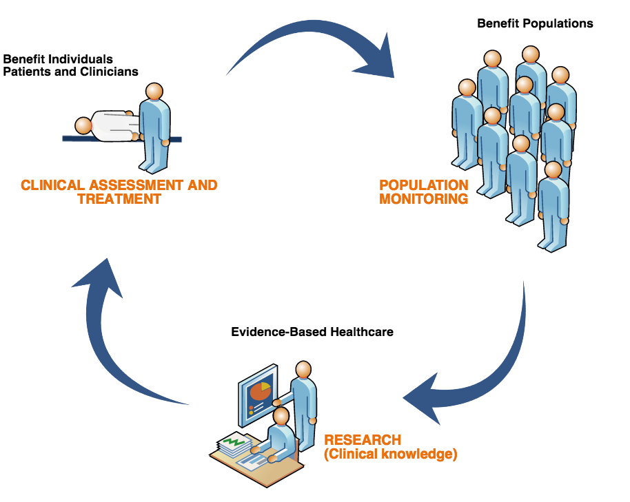

# SNOMED CT Benefits

This section provides an overview of how effective use of SNOMED CT:

* Benefits populations
* Benefits individual patients and clinicians
* Supports evidence based healthcare

## Why is this important?

Understanding the benefits of SNOMED CT will inform key decisions and the development of strategies for adoption, implementation and use of this clinical terminology.

## What is this?

SNOMED CT supports the development of comprehensive high-quality clinical content in health records. It provides a standardized way to represent clinical phrases captured by the clinician and enables automatic interpretation of these. SNOMED CT is a clinically validated, semantically rich, controlled vocabulary that facilitates evolutionary growth in expressivity to meet emerging requirements.

<figure><figcaption></figcaption></figure>

### Electronic Health Records

SNOMED CT based clinical information benefits individual patients and clinicians as well as populations and it supports evidence based care.

The use of an Electronic Health Record (EHR) improves communication and increases the availability of relevant information. If clinical information is stored in ways that allow meaning-based retrieval, the benefits are greatly increased. The added benefits range from increased opportunities for real time decision support to more accurate retrospective reporting for research and management.

### SNOMED CT Enabled Health Records Benefit Individuals

SNOMED CT enabled clinical health records benefit individuals by:

* Enabling relevant clinical information to be recorded using consistent, common representations during a consultation.
* Enabling guideline and decision support systems to check the record and provide real-time advice, for example, through clinical alerts.
* Supporting the sharing of appropriate information with others involved in delivering care to a patient through data capture that allows understanding and interpretation of the information in a common way by all providers.
* Allowing accurate and comprehensive searches that identify patients who require follow-up or changes of treatment based on revised guidelines.
* Removing language barriers (SNOMED CT enables multilingual use).

### SNOMED CT Enabled Health Records Benefit Populations

SNOMED CT enabled clinical health records benefit populations by:

* Facilitating early identification of emerging health issues, monitoring of population health and responses to changing clinical practices.
* Enabling accurate and targeted access to relevant information, reducing costly duplications and errors.
* Enabling the delivery of relevant data to support clinical research and contribute evidence for future improvements in treatment.
* Enhancing audits of care delivery with options for detailed analysis of clinical records to investigate outliers and exceptions.

### SNOMED CT Enabled Health Records Support Evidence-Based Healthcare

SNOMED CT enabled health records inform evidence based health care decisions by:

* Enabling links between clinical records and enhanced clinical guidelines and protocols.
* Enhancing the quality of care experienced by individuals.
* Reducing costs of inappropriate and duplicative testing and treatment.
* Limiting the frequency and impact of adverse healthcare events.
* Raising the cost-effectiveness and quality of care delivered to populations.

<a href="https://docs.google.com/forms/d/e/1FAIpQLScTmbZIf0UEQwYDkY27EEWBkaiYkHSbR0_9DmFrMLXoQLyL7Q/viewform?usp=pp_url&entry.1767247133=Starter+Guide&entry.670899847=SNOMED%20CT%20Benefits" class="button primary">Provide Feedback</a>
