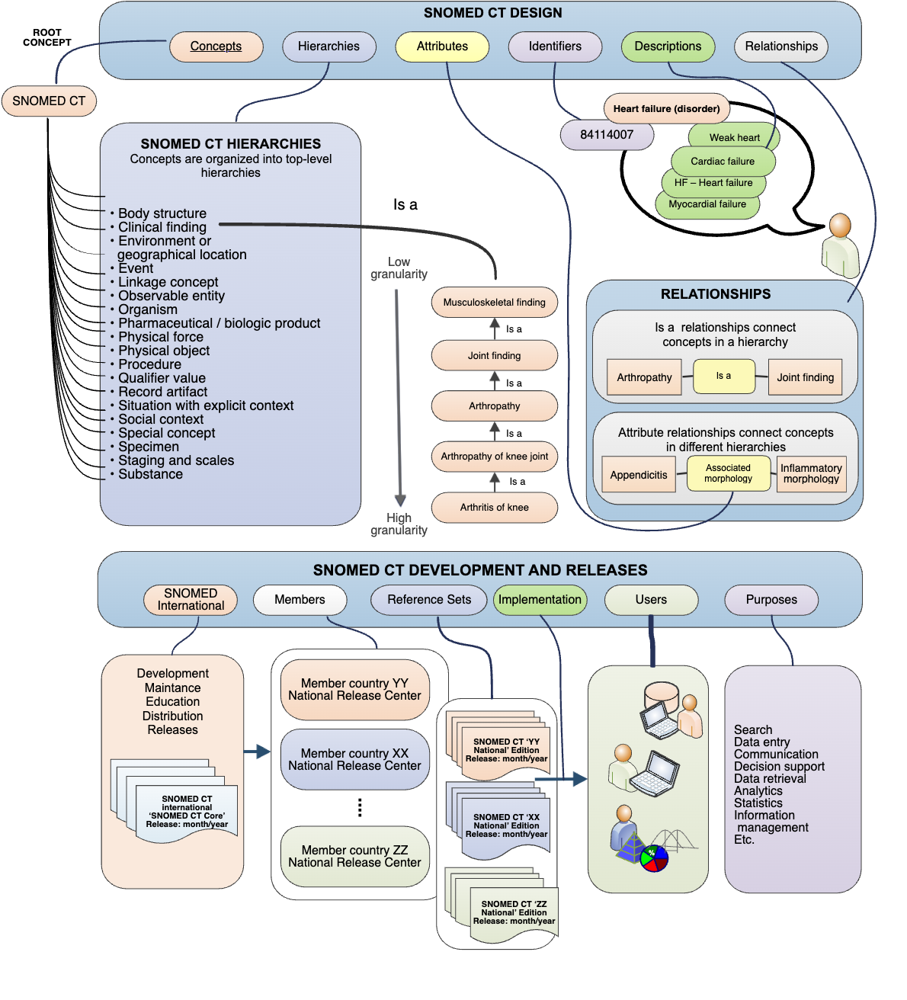

# SNOMED CT Basics

This section provides an overview of:

* SNOMED CT features
* Exploring SNOMED CT
* SNOMED CT design and development
* SNOMED CT components and hierarchies
* SNOMED CT characteristics
* SNOMED CT supporting different languages
* SNOMED CT products and services

## Why is this important?

An awareness of SNOMED CT features, components, characteristics and products provides an initial foundation on which to build greater understanding. It also informs discussions leading to decisions about adoption, implementation and use of this terminology.

## What is this?

### SNOMED CT Features

SNOMED CT:

* Is the most comprehensive, multilingual clinical healthcare terminology in the world.
* Is a resource with comprehensive, scientifically validated clinical content.
* Enables consistent, processable representation of clinical content in electronic health records.
* Is mapped to other international standards.
* Is already used in more than eighty countries.

When implemented in software applications, SNOMED CT can be used to represent clinically relevant information consistently, reliably and comprehensively as an integral part of producing electronic health information.

Implementation requires an understanding of the way that SNOMED CT content is represented by components and supported by reference sets (Refsets).

### Exploring SNOMED CT

While reading the guide, you may find it useful to explore the content of SNOMED CT. You can do this using one of a range of online browsers listed on our web site at [https://www.implementation.snomed.org/browsers](https://www.implementation.snomed.org/browsers). Note that the listed browsers are not endorsed by SNOMED International and they should only be used to a get feel for the content and structure of the terminology. It is useful to experiment with several different browsers as they vary in the way they present particular features of the terminology.

<figure><figcaption></figcaption></figure>

## SNOMED CT Design and Development

### SNOMED CT Components

SNOMED CT is a core clinical healthcare terminology that contains concepts with unique meanings and formal logic based definitions organized into hierarchies. SNOMED CT content is represented using three types of components:

* Concepts representing clinical meanings that are organized into hierarchies.
* Descriptions which link appropriate human readable terms to concepts.
* Relationships which link each concept to other related concepts.

These components are supplemented by reference sets, which provide additional flexible features and enable configuration of the terminology to address different requirements.

#### Concepts

SNOMED CT concepts represent clinical thoughts, ranging from <mark style="color:blue;">|</mark>abscess<mark style="color:blue;">|</mark> to <mark style="color:blue;">|</mark>zygote<mark style="color:blue;">|</mark>. Every concept has a unique numeric concept identifier. Within each hierarchy, concepts are organized from the general to the more detailed. This allows detailed clinical data to be recorded and later accessed or aggregated at a more general level.

#### Descriptions

SNOMED CT descriptions link appropriate human readable terms to concepts. A concept can have several associated descriptions, each representing a synonym that describes the same clinical concept. Each translation of SNOMED CT includes an additional set of descriptions, which link terms in another language to the same SNOMED CT concepts. Every description has a unique numeric description identifier.

#### Relationships

SNOMED CT relationships link concepts to other concepts whose meaning is related in some way. These relationships provide formal definitions and other properties of the concept. One type of relationship is the <mark style="color:blue;">|</mark>is a<mark style="color:blue;">|</mark> relationship which relates a concept to more general concepts. These <mark style="color:blue;">|</mark>is a<mark style="color:blue;">|</mark> relationships define the hierarchy of SNOMED CT concepts.

* For example, the concepts <mark style="color:blue;">|</mark>bacterial pneumonia<mark style="color:blue;">|</mark> and <mark style="color:blue;">|</mark>viral pneumonia<mark style="color:blue;">|</mark> both have an <mark style="color:blue;">|</mark>is a<mark style="color:blue;">|</mark> relationship to <mark style="color:blue;">|</mark>pneumonia<mark style="color:blue;">|</mark> which has an <mark style="color:blue;">|</mark>is a<mark style="color:blue;">|</mark> relationship to the more general concept <mark style="color:blue;">|</mark>infectious disease of lung<mark style="color:blue;">|</mark>.

Other types of relationships represent aspects of the meaning of a concept.

* For example, the concept <mark style="color:blue;">|</mark>viral pneumonia<mark style="color:blue;">|</mark> has a <mark style="color:blue;">|</mark>causative agent<mark style="color:blue;">|</mark> relationship to the concept <mark style="color:blue;">|</mark>virus<mark style="color:blue;">|</mark> and a <mark style="color:blue;">|</mark>finding site<mark style="color:blue;">|</mark> relationship to the concept <mark style="color:blue;">|</mark>structure of parenchyma of lung<mark style="color:blue;">|</mark>.

Every relationship has a unique numeric relationship identifier.

#### Reference sets

Reference sets (Refsets) are a flexible standard approach used by SNOMED CT to support a variety of requirements for customization and enhancement of SNOMED CT. These include the representation of subsets, language preferences for use of particular terms and mapping from or to other code systems. Every reference set has a unique numeric concept identifier.

### SNOMED CT Hierarchies

SNOMED CT concepts are organized in hierarchies. Within a hierarchy concepts range from the more general to the more detailed. Related concepts in the hierarchy are linked using the |is a| relationship.

* Examples of some of the hierarchies include <mark style="color:blue;">|</mark>clinical finding<mark style="color:blue;">|</mark>, <mark style="color:blue;">|</mark>procedure<mark style="color:blue;">|</mark>, <mark style="color:blue;">|</mark>observable entity<mark style="color:blue;">|</mark>, <mark style="color:blue;">|</mark>body structure<mark style="color:blue;">|</mark> and <mark style="color:blue;">|</mark>organism<mark style="color:blue;">|</mark>.

### SNOMED CT Characteristics - Comprehensive, Scalable and Flexible

SNOMED CT has a broad coverage of health related topics. It can be used to describe a patient's medical history, the details of an orthopedic procedure, the spread of epidemics, and much more. At the same time, the terminology has an unmatched depth, which enables clinicians to record data at the appropriate level of granularity.

Specific applications tend to focus on a restricted set of SNOMED CT, such as concepts related to ophthalmology. These subsets can be used to present relevant parts of the terminology, depending on the clinical context and local requirements. This means for example, that a drop down list to select diagnoses in an electronic health record in a mental health facility can be tailored to that setting. Similarly, subsets can be defined for problem lists for physician specialties or to provide appropriate medication lists for nurses in community care.

When individual jurisdictions have needs beyond those that can be reflected in a global terminology, perhaps due to requirements in local legislation, they can develop local or national extensions. Thus, even though SNOMED CT is global in scope, it can be adapted to each country's or areas requirements. SNOMED CT maps work to provide explicit links to health related classifications and coding schemes in use around the world, e.g. statistical classifications such as ICD-10. Maps to or from several national code systems are also available from, or under development, by Members. Maps to or from clinical domain specific code systems are also maintained by specialty groups with which SNOMED International has collaborative agreement. Maps facilitate reuse of SNOMED CT based clinical data for other purposes, such as reimbursement or statistical reporting.

### Supporting Different Languages

SNOMED CT is a multinational, multilingual terminology. It has a built-in framework to manage different languages and dialects. The International Release includes a set of language independent concepts and relationships. Today, SNOMED CT is available in many languages that can be viewed in the SNOMED International SNOMED CT Browser. The basic objective of any SNOMED CT translation is to provide accurate representations of SNOMED CT concepts in a way that is understandable, usable, and safe. Translation must be concept based. Translators need to analyse concepts based on the fully specified name and take account of its position within the hierarchy, its descriptions, and its relationships to other concepts. This enables a meaningful translation of a concept based on phrases that are well used and clearly understood in all countries. SNOMED International maintains guidelines and other materials to support countries undertaking translations.

### SNOMED CT Products and Services

Members and organizations covered by the SNOMED CT Affiliate License have access to a range of products and services, including:

* SNOMED CT terminology files consisting of:
  * Concepts
  * Descriptions
  * Relationships
* Derivative works that help in the uptake and use of SNOMED CT, including Reference Sets that support:
  * Identification of subsets of SNOMED CT content
  * Language or dialect preferences for use of particular descriptions
  * Maps to other code systems and classifications
  * Other relevant metadata to support use of SNOMED CT components.
* Guidance for successful use of SNOMED CT including:
  * Implementation guidance
  * Translation guidance
  * Editorial guidance for content development
* Access to services supporting submission of requests for changes or additions to content and documentation.
* Participation in the global SNOMED International community through an electronic collaborative space and meeting of special interest groups.
