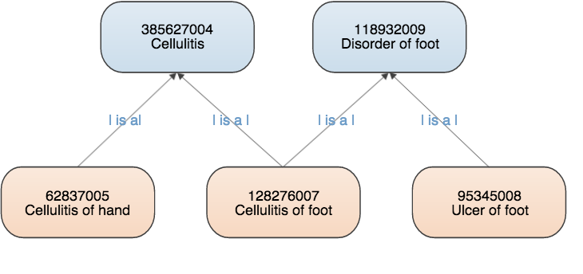
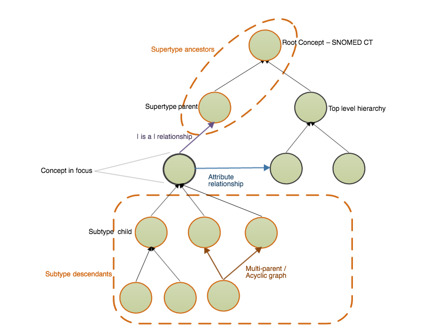
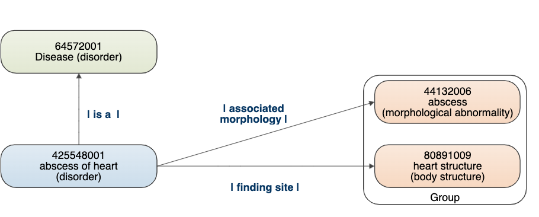

# 5. SNOMED CT Logical Model

This section provides an overview of:

* Logical Model Components – representing the core content of the terminology
* Reference Sets – configuring and enhancing terminology content

## Why is this important?

The SNOMED CT logical model provides the fundamental structure of SNOMED CT and specifies how the components can be managed in an implementation setting to meet a variety of primary and secondary uses.

## What is this?

The SNOMED CT logical model defines the way in which each type of SNOMED CT component and derivative is related and represented. The core component types in SNOMED CT are concepts, descriptions and relationships. The logical model therefore specifies a structured representation of the concepts used to represent clinical meanings, the descriptions used to refer to these, and the relationships between the concepts.

<<<<<<< HEAD
\|&#x20;

<figure><figcaption></figcaption></figure>

_**Logical Model Overview**_
=======

__Logical Model Overview__
>>>>>>> d7e4c20 (Fixed)

### Concepts

Every concept represents a unique clinical meaning, which is referenced using a unique, numeric and machine-readable SNOMED CT identifier. The identifier provides an unambiguous unique reference to each concept and does not have any ascribed human interpretable meaning.

* Other types of components also have unique identifiers – however, the concept identifier has a specific role as the code used to represent the meaning in clinical records, documents, messages and data.

### Descriptions

A set of textual descriptions are assigned to every concept. These provide the human readable form of a concept. Two types of description are used to represent every concept - Fully Specified Name (FSN) and Synonym. Additionally a Definition maybe added on a case-by case basis if required.

The FSN represents a unique, unambiguous description of a concept's meaning. The FSN is not intended to be displayed in clinical records, but is instead used to disambiguate the distinct meaning of each different concept. This is particularly useful when different concepts are referred to by the same commonly used word or phrase. Each concept can have only one FSN in each language or dialect.

A [synonym](https://confluence.ihtsdotools.org/display/DOCGLOSS/synonym) represents a [term](https://confluence.ihtsdotools.org/display/DOCRELFMT/term+\(field\)) that can be used to display or select a [concept](https://confluence.ihtsdotools.org/display/DOCGLOSS/concept). A concept may have several synonyms. This allows users of SNOMED CT to use the terms they prefer to refer to a specific clinical meaning. Concepts can have multiple synonyms, and the associated terms are not necessarily unique – thus two concepts may have the same synonym term. Interpretation of a synonymous term therefore depends on the concept identifier.

Each concept has one synonym which is marked as |preferred| in a given language, dialect, or context of use. This is known as the "preferred term" and is a word or phrase commonly used by clinicians to name that concept. In each language, dialect or context of use, one and only one synonym can be marked as |preferred|. Any number of other synonyms that are valid in a language, dialect or context of use can be marked as |acceptable|.

A Definition is a textual description that has been applied to some SNOMED CT concepts that provides additional information about the intended meaning of the concept.

<<<<<<< HEAD
## | 
=======

>>>>>>> d7e4c20 (Fixed)

_Example of descriptions for a single concept (US - English)_

### Relationships

A relationship represents an association between two concepts. Relationships are used to logically define the meaning of a concept in a way that can be processed by a computer. A third concept, called a relationship type (or attribute), is used to represent the meaning of the association between the source and destination concepts. There are different types of relationships available within SNOMED CT.

<<<<<<< HEAD
## | 

Example of _attribute relationships_
=======

Example of  _attribute relationships_
>>>>>>> d7e4c20 (Fixed)

#### Subtype Relationships

Subtype relationships are the most widely used type of relationship. Subtype relationships use the |is a| relationship type and are therefore also known as |is a| relationships. Almost all active SNOMED CT concepts are the source of at least one |is a| relationship. The only exception is the root concept |SNOMED CT Concept| which is the most general concept. The |is a| relationship states that the source concept is a subtype of the destination concept. SNOMED CT relationships are directional and the |is a| relationship read in the reverse direction states that the destination concept is a supertype of the source concept.

<<<<<<< HEAD
## | 

_Example of_ \_|\__is a_ \_|\__relationships_
=======

_Example of_ _|__is a_ _|__relationships_
>>>>>>> d7e4c20 (Fixed)

The |is a| relationships form the hierarchies of SNOMED CT. They are therefore also known as hierarchical relationships. The source concept of the |is a| relationship has a more specific clinical meaning than the target concept. This means that the level of clinical detail of the concepts increases with the depth of the hierarchies.

If two concepts are directly linked by a single |is a| relationship, the source concept is said to be a "subtype child" of the destination concept. The destination concept is referred to as a "supertype parent". Any concept that is the source of a sequence of one or more |is a| relationships leading to a specified destination concept, is a "subtype descendant" of that concept. Similarly, any concept that is the destination of a sequence of one or more |is a| relationships leading to a specified source concept, is a "supertype ancestor" of that concept. It is also said that the source concept of an |is a| relationship "is subsumed by" the target concept, and that the target concept of an |is a| relationship "subsumes" the source concept.

Each concept can have |is a| relationships to several other concepts (i.e. a concept may have multiple supertype parent concepts). As a result the SNOMED CT hierarchy is not a simple tree but has a structure that is known as a "polyhierarchy".

<<<<<<< HEAD
## | 
=======

>>>>>>> d7e4c20 (Fixed)

_Illustration of SNOMED CT subtype hierarchy and terms used to describe it_

#### Attribute Relationships

An attribute relationship contributes to the definition of the source concept by associating it with the value of a defining characteristic. The characteristic (attribute) is specified by the relationship type and the value is provided by the destination of the relationship.

The following example shows the defining relationships of the concept |abscess of heart|. The attribute relationships |associated morphology| and |finding site| are used to associate the source concept |abscess of heart| to respectively the target concepts |abscess|, and |heart structure|.

<<<<<<< HEAD
## | 
=======

>>>>>>> d7e4c20 (Fixed)

_Example of defining relationships_

Unlike |is a| relationships, which are used to define all concepts, the applicability of each type of attribute relationship is limited to a defined domain and range. The domain refers to the concepts that can serve as source concepts for that type of attribute relationship. The range refers to the concepts that can serve as destinations (values) for those attributes. The domain and range specification ensure consistent definitions that can be used to infer additional semantic relationships to deliver reliable meaning-based retrieval of the composed meanings.

The first example below violates the domain constraint of |causative agent|, as descendants of |body structure| are not in the domain of |causative agent|. The second example below is valid with respect to the domain constraint of |causative agent|, because |disorder| is in the domain of |causative agent|. However, this example violates the range constraint of |causative agent|, as descendants of morphological abnormality are not in the range of |causative agent|.

<<<<<<< HEAD
## | 
=======

>>>>>>> d7e4c20 (Fixed)

_Example of erroneous relationships_

### Defined and Primitive Concepts

In SNOMED CT every concept is specified as either defined or primitive.

A [concept](https://confluence.ihtsdotools.org/display/DOCGLOSS/concept) is _defined_ if its [defining characteristics](https://confluence.ihtsdotools.org/display/DOCGLOSS/defining+characteristic) are sufficient to distinguish its meaning from other similar concepts. One example is that the [concept](https://confluence.ihtsdotools.org/display/DOCGLOSS/concept)|acute disease| is _defined_ by its two defining [relationships](https://confluence.ihtsdotools.org/display/DOCGLOSS/relationship). The first [relationship](https://confluence.ihtsdotools.org/display/DOCGLOSS/relationship) is |is a| |disease| and the second [relationship](https://confluence.ihtsdotools.org/display/DOCGLOSS/relationship) is |clinical course| of |sudden onset AND/OR short duration|. Stating that this concept is _defined_ means that any concept that |is a| |disease| and has a |clinical course| of |sudden onset AND/OR short duration| is a subtype of this concept (or the concept itself).

A [concept](https://confluence.ihtsdotools.org/display/DOCGLOSS/concept) is [primitive](https://confluence.ihtsdotools.org/display/DOCGLOSS/primitive+concept) (not defined) if its [defining characteristics](https://confluence.ihtsdotools.org/display/DOCGLOSS/defining+characteristic) are not sufficient to uniquely distinguish its meaning from other similar concepts. One example is that the [primitive concepts](https://confluence.ihtsdotools.org/display/DOCGLOSS/primitive+concept)|disease| and |drug action| share the same [defining characteristics](https://confluence.ihtsdotools.org/display/DOCGLOSS/defining+characteristic): namely a [relationship](https://confluence.ihtsdotools.org/display/DOCGLOSS/relationship) of type |is a| to the [concept](https://confluence.ihtsdotools.org/display/DOCGLOSS/concept)|clinical finding|. This is despite the fact that the [concepts](https://confluence.ihtsdotools.org/display/DOCGLOSS/concept)|disease| and |drug action| represent different clinical ideas.

### Reference Sets

Reference Sets (Refsets) are a standard way to represent additional non-defining information about members of a set of components. Reference Sets are important as they can be used in SNOMED CT enabled applications to constrain, configure and enhance functionality to match requirements for different use cases. Some examples of the many uses of reference sets are to represent:

* **Language and dialect preferences** for use of particular terms to describe a concept. Language Reference Sets allow the preferred and acceptable descriptions to be configured for a language, dialect or context of use.
* **Subsets of components that are included in or excluded** from the set of values that can be used in a particular country, organization, specialty or context.
* **Value sets of concepts** limiting the permitted content of a field in line with requirements of standard message or communication interface.
* **Frequently used descriptions or concepts** that can be prioritized for searches in a particular country, organization, specialty or context.
* **Structuring and ordering of lists and hierarchies** to display concepts in convenient structured lists or tree-view controls to assist entry of particular data items.
* **Maps to or from\*\*\*\*other code systems** the maps supported by Reference Sets includes simple one-to-one maps and more complex maps requiring human-readable advice or machine processable rules to resolve ambiguities.
