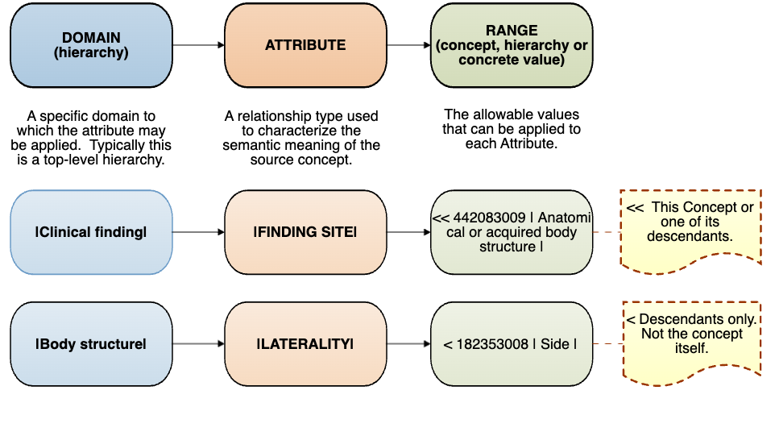

# SNOMED CT Concept Model

This section provides an overview of:

* Concept Model – Top Level Hierarchies
* Concept Model Attributes – Representing Characteristics of a Concept

## Why is this important?

The SNOMED CT concept model specifies the way in which SNOMED CT concepts are defined using a combination of formal logic and editorial rules. Concept model rules specify the top level concepts under which concepts are arranged in the subtype hierarchy and the types of relationships that are permitted between concepts in particular branches of the hierarchy.

## What is this?

### Concept Model – Top Level Hierarchies

The top of the SNOMED CT hierarchy is occupied by the root concept (<mark style="color:blue;">|</mark>SNOMED CT concept<mark style="color:blue;">|</mark>). All concepts are descended from this root concept through at least one sequence of <mark style="color:blue;">|</mark>is a<mark style="color:blue;">|</mark> relationships. This means that the root concept is a supertype of all other concepts and all other concepts are subtypes of the root concept.

The direct subtypes of the root concept are referred to as 'Top Level Concepts'. These concepts are used to name the main branches of the hierarchy. Each of these Top Level Concepts, together with their many subtype descendants, forms a major branch of the SNOMED CT hierarchy and contains similar types of concepts. As the hierarchies descend (that is, more <mark style="color:blue;">|</mark>is a<mark style="color:blue;">|</mark> relationships are added below the Top Level Concepts) the concepts within them become increasingly specific.

Below is a list of the Top Level Concepts with a brief description of the content represented in their branch of the hierarchy.

* <mark style="color:blue;">|</mark>**Clinical finding**<mark style="color:blue;">|</mark> represents the result of a clinical observation, assessment or judgment and includes normal and abnormal clinical states (e.g. <mark style="color:blue;">|</mark>asthma<mark style="color:blue;">|</mark>, <mark style="color:blue;">|</mark>headache<mark style="color:blue;">|</mark>, <mark style="color:blue;">|</mark>normal breath sounds<mark style="color:blue;">|</mark>). The <mark style="color:blue;">|</mark>clinical finding<mark style="color:blue;">|</mark> hierarchy includes concepts used to represent diagnoses.
* <mark style="color:blue;">|</mark>**Procedure**<mark style="color:blue;">|</mark> represents activities performed in the provision of health care. This includes not only invasive procedures but also administration of medicines, imaging, education, therapies and administrative procedures (e.g. <mark style="color:blue;">|</mark>appendectomy<mark style="color:blue;">|</mark>, <mark style="color:blue;">|</mark>physiotherapy<mark style="color:blue;">|</mark>, <mark style="color:blue;">|</mark>injection into subcutaneous tissue<mark style="color:blue;">|</mark>).
* <mark style="color:blue;">|</mark>**Situation with explicit context**<mark style="color:blue;">|</mark> represents concepts in which the clinical context is specified as part of the definition of the concept itself. These include presence or absence of a condition, whether a clinical finding is current, in the past or relates to someone other than the subject of the record (e.g. <mark style="color:blue;">|</mark>endoscopy arranged<mark style="color:blue;">|</mark>, <mark style="color:blue;">|</mark>past history of myocardial infarction<mark style="color:blue;">|</mark>, <mark style="color:blue;">|</mark>family history of glaucoma<mark style="color:blue;">|</mark>).
* <mark style="color:blue;">|</mark>**Observable entity**<mark style="color:blue;">|</mark> represents a question or assessment which can produce an answer or result (e.g. <mark style="color:blue;">|</mark>systolic blood pressure<mark style="color:blue;">|</mark>, <mark style="color:blue;">|</mark>color of iris<mark style="color:blue;">|</mark>, <mark style="color:blue;">|</mark>gender<mark style="color:blue;">|</mark>).
* <mark style="color:blue;">|</mark>**Body structure**<mark style="color:blue;">|</mark> represents normal and abnormal anatomical structures (e.g. <mark style="color:blue;">|</mark>mitral valve structure<mark style="color:blue;">|</mark>, <mark style="color:blue;">|</mark>adenosarcoma<mark style="color:blue;">|</mark>).
* |**Organism**| represents organisms of significance in human medicine (e.g. |streptococcus pyogenes|, |domain Bacteria|, |glossina|).
* |**Substance**| represents general substances, the chemical constituents of pharmaceutical/biological products, body substances, dietary substances and diagnostic substances (e.g. |methane|, |insulin|, |albumin|).
* |**Pharmaceutical**/**biologic product**| represents drug products (e.g. |amoxicillin 250mg oral capsule|, |product containing codeine and paracetamol|).
* |**Specimen**| represents entities that are obtained (usually from the patient) for examination or analysis (e.g. |urine specimen|, |specimen from prostate obtained by needle biopsy|).
* |**Special concept**| represents concepts that do not play a part in the formal logic of the concept model of the terminology, but which may be useful for specific use cases (e.g. |navigational concept|, |alternative medicine poisoning|).
* |**Physical object**| represents natural and man-made physical objects (e.g. |vena cava filter|, |implant device|, |automobile|).
* |**Physical force**| represents physical forces that can play a role as mechanisms of injury (e.g. |friction|, |radiation|, |alternating current|).
* |**Event**| represents occurrences excluding procedures and interventions (e.g. |flood|, |earthquake|).
* |**Environments and geographical locations**| represents types of environments as well as named locations such as countries, states and regions (e.g. |intensive care unit|, |academic medical center|, |Denmark|).
* |**Social context**| represents social conditions and circumstances significant to health care (e.g. |occupation|, |spiritual or religious belief|).
* |**Staging and scales**| represents assessment scales and tumor staging systems (e.g. |Glasgow Coma Scale|, |FIGO staging system of gynecological malignancy|).
* |**Qualifier value**| represents the values for some SNOMED CT attributes, where those values are not subtypes of other top level concepts. (e.g. |left|, |abnormal result|, |severe|).
* |**Record artifact**| represents content created for the purpose of providing other people with information about record events or states of affairs. (e.g. |patient held record|, |record entry|, |family history section|).
* |**SNOMED CT Model Component**| contains technical metadata supporting the SNOMED CT release.

### Concept Model Attributes – Representing Characteristics of a Concept

SNOMED CT attributes (or relationship types) are used to represent a characteristic of the meaning of a concept. SNOMED CT currently uses more than one hundred defining attributes when defining the meaning of concepts. Each SNOMED CT attribute can be applied to concepts in one or more branches of the hierarchy. The set of concepts to which an attribute can be applied is called the 'domain' of the attribute. The permitted set of values for each attribute is called the 'range' of the attribute.

#### _**Domain**_

The _domain_ is the hierarchy to which a specific attribute can be applied.

For example:

The domain of the attribute |associated morphology| is the |clinical finding| hierarchy. Therefore, a |procedure| cannot have an |associated morphology|. However, a |procedure| can have a |procedure morphology|.

#### _**Range**_

The _range_ is the set of SNOMED CT concepts or concrete values that are allowed as the value of a specified attribute.

For example:

The range for the attribute |associated morphology| is the concept |morphologically abnormal structure| and its subtype descendants. The range for the attribute |finding site| is |anatomical or acquired body structure| and its subtype descendants in the |body structure| hierarchy.

_Examples of the domain and range specified for the attributes_ _|finding site|_ _and_ _|laterality|_

<figure><figcaption></figcaption></figure>

Some SNOMED CT attributes (or relationship types) have a hierarchical relationship to one another. The hierarchy formed from such relationships is known as an 'attribute hierarchy'. In an attribute hierarchy, one general attribute is the parent of one or more specific subtypes of that attribute. Subtypes of a concept defined using the more general attribute can be defined using a more specific subtype of that attribute. For example, |after|, |causative agent| and |due to| are subtypes of |associated with|, because they have a more specific meaning.

### Concept Model and Editorial Guidance

#### Editorial Guide

SNOMED CT is an evolving terminology, which means that the attributes used to define concepts in specific hierarchies may change over time. Additionally, editorial principles, that are specified to ensure consistent representation of the same type of concepts may also change. When authoring SNOMED CT content, it is therefore important to always refer to the current SNOMED CT Editorial Guide. The Editorial Guide specifies the attributes that are valid to use within each hierarchy and the valid values that can be assigned to each attribute. It also presents general editorial rules for SNOMED CT content, along with specific guidance on authoring concepts within each hierarchy.

#### Machine Readable Concept Model

The Machine Readable Concept Model (MRCM) represents rules in the SNOMED CT concept model in a form that can be read by a computer and applied to test that concept definitions and expressions comply with the rules. The MRCM may be used for a variety of purposes, including the authoring and validation of SNOMED CT concepts, expressions, expression constraints and queries, Natural Language Processing and terminology binding to support semantic interoperability. For further information, please visit the guide on the Machine Readable Concept Model or visit the MRCM Browser.

### Attributes Used to Define SNOMED CT Concepts

The SNOMED CT defining attributes are used to represent the meaning of concepts in many hierarchies, for example:

* Clinical finding concepts
* Procedure concepts

For further information, please refer to the SNOMED CT Editorial Guide.

#### Attributes Used to Define Clinical Finding Concepts

Below is a list of some of the attributes used to define |clinical finding| concepts, and a brief description of their meaning:

|**Finding site**| specifies the body site affected by a condition.

|**Associated morphology**| specifies the morphologic changes seen at the tissue or cellular level that are characteristic features of a disease.

|**Associated with**| represents a clinically relevant association between concepts without either asserting or excluding a causal or sequential relationship between the two.

|**After**| represents a sequence of events where a clinical finding occurs after another |clinical finding| or |procedure| or |event|.

|**Due to**| relates a |clinical finding| directly to a cause such as another |clinical finding| or a |procedure|.

|**Causative agent**| identifies the direct causative agent of a disease such as an |organism|, |substance| or |physical force|. (Note: This attribute is not used for vectors, such as mosquitos transmitting malaria).

|**Severity**| used to sub-class a |clinical finding| concept according to its relative severity.

|**Clinical course**| represents both the onset and course of a disease.

|**Episodicity**| represents episodes of care provided by a physician or other care provider, such as a general practitioner. This attribute is not used to represent episodes of disease experienced by the patient.

|**Interprets**| refers to the entity being evaluated or interpreted, when an evaluation, interpretation or judgment is intrinsic to the meaning of a concept.

|**Has interpretation**| when grouped with the attribute |interprets|, designates the judgment aspect being evaluated or interpreted for a concept. (e.g. presence, absence etc.)

|**Pathological process**| provides information about the underlying pathological process of a disorder, i.e. it describes the process that results in the structural or morphologic change.

|**Occurrence**| refers to a specific period of life during which a condition first presents.

|**Finding method**| specifies the means by which a clinical finding was determined. This attribute is frequently used in conjunction with |finding informer|.

|**Finding informer**| specifies the person (by role) or other entity (e.g. a monitoring device) from which the clinical finding information was obtained. This attribute is frequently used in conjunction with |finding method|.

#### Attributes Used to Define Procedure Concepts

Below is a list of some of the attributes used to define |procedure| concepts, and a brief description of their meaning:

|**Procedure site**| describes the body site acted on or affected by a procedure.

|**Procedure morphology|** specifies the morphology or abnormal structure involved in a procedure.

|**Method**| represents the action being performed to accomplish the procedure. It does not include the surgical approach, equipment or physical forces.

|**Procedure device**| describes the devices associated with a procedure.

|**Access**| describes the route used to access the site of the procedure.

|**Direct substance**| describes the |substance| or |pharmaceutical / biologic product| on which the procedure's method directly acts.

|**Occurrence**| refers to a specific period of life during which a procedure is undertaken.

|**Priority**| refers to the priority assigned to a procedure.

|**Has focus**| specifies the |clinical finding| or |procedure| which is the focus of a procedure.

|**Has intent**| specifies the intent of a procedure.

|**Recipient category**| specifies the type of individual or group upon which the action of the procedure is performed.

|**Revision status**| specifies whether a procedure is primary or a revision.

|**Using substance**| describes the substance used to execute the action of a procedure, but it is not the substance on which the procedure's method directly acts.

|**Using energy**| describes the energy used to execute an action.

#### All Attributes Values Used to Define SNOMED CT Concepts

For attribute values or range, please consult the Editorial Guide (refer to section on [Domain Specific Modeling](https://confluence.ihtsdotools.org/display/DOCEG/Domain+Specific+Modeling), then the appropriate Attributes Summary) or the [MRCM Browser](https://browser.ihtsdotools.org/mrcm).
