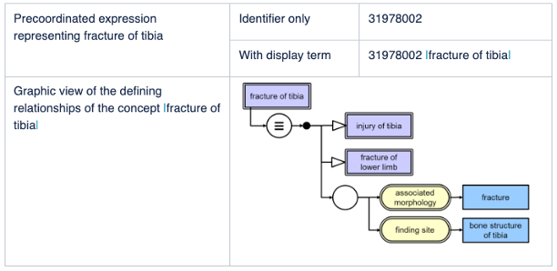

# SNOMED CT Expressions

This section provides an overview of:

* Precoordinated Expressions
* Postcoordinated Expressions

## Why is this important?

SNOMED CT provides a mechanism that enables clinical phrases to be represented, even when a single SNOMED CT concept does not capture the required level of detail. This is important as it enables a wide range of clinical meanings to be captured in a record, without requiring the terminology to include a separate concept for every detailed combination of ideas that may potentially need to be recorded. Application software that supports the use of SNOMED CT expressions enables detailed clinical information to be recorded, retrieved and analyzed.

## What is this?

Clinical expressions using SNOMED CT concepts can be of two types: precoordinated expressions, which use a single SNOMED CT concept identifier; and postcoordinated expressions, which contain more than one SNOMED CT identifier.

SNOMED CT support of the postcoordination technique allows additional clinical detail to be represented if required. Postcoordination greatly increases the depth of detail that SNOMED CT can represent without having to include every possible specific site for every possible disorder via a concept. For example, the concept |bacterial pneumonia| has a defining relationship specifying its <mark style="color:blue;">|</mark>causative agent<mark style="color:blue;">|</mark> as <mark style="color:blue;">|</mark>bacteria<mark style="color:blue;">|</mark> and this can be refined to <mark style="color:blue;">|</mark>streptococcus pneumoniae<mark style="color:blue;">|</mark>.

SNOMED CT expressions are a structured combination of one or more concept identifiers used to represent a clinical idea in a logical manner, which is automatically processable. Expressions are represented using the SNOMED CT compositional grammar, which is a lightweight syntax for the representation of SNOMED CT expressions.

The logic on which the SNOMED CT concept model is based allows alternative representations of the same or similar information to be recognized and compared.

### Precoordinated Expressions

Precoordinated expressions are expressions that represent the meaning of individual concepts which are predefined in SNOMED CT. Besides the unique concept identifier and descriptions, each concept also has a formal logic definition represented by a set of defining relationships to other concepts. The figure below shows the precoordinated expression used to record |fracture of tibia|. It illustrates that this can be represented by a single identifier, with or without an accompanying human-readable term. It also illustrates the defining relationships of the concept identified in the expression. This is the precoordinated definitional knowledge which is conveyed by this expression.

<figure><figcaption></figcaption></figure>

The second example shown below illustrates the fact that some SNOMED CT concepts provide quite a lot of detailed refinement, some of which might otherwise be captured separately. We will return to this example when considering postcoordination.

**Example: Precoordinated representation of "Laparoscopic emergency appendectomy"**\
SNOMED CT contains the concept 174041007 <mark style="color:blue;">|</mark>laparoscopic emergency appendectomy<mark style="color:blue;">|</mark>. The identifier of this concept (174041007) can be used (with or without the associated term) as a precoordinated expression to record an instance of this procedure.\
The procedure 'laparoscopic emergency appendectomy' has at least three distinct facets: 'excision of appendix', 'using a laparoscope' as 'emergency procedure'. The SNOMED CT concept 174041007 |laparoscopic emergency appendectomy| precoordinates these facets as its definition includes the following defining relationships:

* 116680003 <mark style="color:blue;">|</mark>is a<mark style="color:blue;">|</mark> = 71388002 <mark style="color:blue;">|</mark>procedure<mark style="color:blue;">|</mark>
* 260870009 <mark style="color:blue;">|</mark>priority<mark style="color:blue;">|</mark> = 25876001 <mark style="color:blue;">|</mark>emergency<mark style="color:blue;">|</mark>
* 424226004 <mark style="color:blue;">|</mark>using device<mark style="color:blue;">|</mark> = 86174004 <mark style="color:blue;">|</mark>laparoscope<mark style="color:blue;">|</mark>
* 260686004 <mark style="color:blue;">|</mark>method<mark style="color:blue;">|</mark> = 129304002 <mark style="color:blue;">|</mark>excision - action<mark style="color:blue;">|</mark>
* 405813007 <mark style="color:blue;">|</mark>procedure site - direct<mark style="color:blue;">|</mark> = 66754008 <mark style="color:blue;">|</mark>appendix structure<mark style="color:blue;">|</mark>

### Postcoordinated Expressions

Expressions that contain two or more concept identifiers are referred to as postcoordinated expressions. Postcoordination combines concepts and allows more detail to be added to the meaning represented by a single concept. A postcoordinated expression is not just a list of concept identifiers, it follows a set of rules that mimic the way attributes and values are used to define SNOMED CT concepts.

**Example: Postcoordinated representation of "Laparoscopic emergency appendectomy"**

Although SNOMED CT contains the concept <mark style="color:blue;">|</mark>laparoscopic emergency appendectomy<mark style="color:blue;">|</mark>, it is also possible to represent this clinical phrase using the following postcoordinated expression.

* 6025007 <mark style="color:blue;">|</mark>laparoscopic appendectomy<mark style="color:blue;">|</mark> :260870009 <mark style="color:blue;">|</mark>priority<mark style="color:blue;">|</mark> = 25876001 <mark style="color:blue;">|</mark>emergency<mark style="color:blue;">|</mark>

This postcoordinated expression has exactly the same meaning as the precoordinated expression

* 174041007 <mark style="color:blue;">|</mark>laparoscopic emergency appendectomy<mark style="color:blue;">|</mark>

The fact that the two expressions have the same meaning can be computed because

* 174041007 <mark style="color:blue;">|</mark>laparoscopic emergency appendectomy<mark style="color:blue;">|</mark> is a defined subtype descendant of 6025007 <mark style="color:blue;">|</mark>laparoscopic appendectomy<mark style="color:blue;">|</mark>; and
* the only differences between the defining attributes of these concepts are the addition of
  * 260870009 <mark style="color:blue;">|</mark>priority<mark style="color:blue;">|</mark> = 25876001 <mark style="color:blue;">|</mark>emergency<mark style="color:blue;">|</mark>

The example above shows that postcoordination can be applied even when a single concept is available to represent the required meaning. However, the real strength of postcoordination is that it allows a clinical phrase to be represented even when the precise concept is not present in SNOMED CT. In these cases, postcoordinated refinements can be applied to an existing concept to more precisely capture the required meaning.

**Example: Postcoordinated representation of "Intolerance to histamine"**&#x20;

SNOMED CT does not contain a concept that represents this clinical idea. However, it is possible to represent it using the following postcoordinated expression. 782197009 <mark style="color:blue;">|</mark>intolerance to substance<mark style="color:blue;">|</mark> : 47429007 <mark style="color:blue;">|</mark>associated with<mark style="color:blue;">|</mark> = 54235008 <mark style="color:blue;">|</mark>histamine<mark style="color:blue;">|</mark>.

Postcoordinated expressions may be created at run-time by selection of individual facets of a concept. For example, to indicate the nature and location of a fracture for a particular bone and, where relevant, whether the bone affected is on the right or left. Some applications allow generation of postcoordinated expression using natural language processing. Alternatively, postcoordinated expression can be selected during user interface design and bound to simple data entry options. In these cases, the user may not be aware that the information is being captured in a postcoordinated form.

#### Representing Postcoordination

There are several valid ways to represent and store postcoordinated expressions. However, to support interoperability, SNOMED International has specified a standard SNOMED CT compositional grammar form that is both human-readable and computer processable. The examples of expression that you see in this guide use this grammar.

**The basics of SNOMED CT compositional grammar**

* At its simplest level a single SNOMED CT concept identifier is a valid expression.
  * 80146002
* A concept identifier can optionally be followed by a term associated with that concept enclosed between two pipe characters
  * 80146002 <mark style="color:blue;">|</mark>appendectomy<mark style="color:blue;">|</mark>
* A concept identifier (with or without a following term) can be followed by a refinement. The refinement follows a colon
  * 80146002 <mark style="color:blue;">|</mark>appendectomy<mark style="color:blue;">|</mark> **:**_< refinement>_
* A refinement consists of a sequence of one or more attribute-value pairs. Both the attribute and the value are represented by a concept identifier (with or without a following term). The attribute is separated from the value by an equals sign
  * 80146002 <mark style="color:blue;">|</mark>appendectomy<mark style="color:blue;">|</mark> **:** 260870009 <mark style="color:blue;">|</mark>priority<mark style="color:blue;">|</mark> **=** 25876001 <mark style="color:blue;">|</mark>emergency<mark style="color:blue;">|</mark>
* If there is more than one attribute-value pair, the pairs are separated by commas
* Curly braces represent grouping of attributes within a refinement, for example to indicate that the method applies to a specific site
  * 80146002 <mark style="color:blue;">|</mark>appendectomy<mark style="color:blue;">|</mark> : **{**&#x32;60686004 <mark style="color:blue;">|</mark>method<mark style="color:blue;">|</mark> = 129304002 <mark style="color:blue;">|</mark>excision - action<mark style="color:blue;">|</mark>, 405813007 <mark style="color:blue;">|</mark>procedure site - direct<mark style="color:blue;">|</mark> = 181255000 <mark style="color:blue;">|</mark>entire appendix<mark style="color:blue;">|</mark>**}**
* Round brackets represent nesting to allow the value of an attribute to be refined
  * 161615003 <mark style="color:blue;">|</mark>history of surgery<mark style="color:blue;">|</mark> : 363589002 <mark style="color:blue;">|</mark>associated procedure<mark style="color:blue;">|</mark> = **(**&#x38;0146002 <mark style="color:blue;">|</mark>appendectomy<mark style="color:blue;">|</mark> : 260870009 <mark style="color:blue;">|</mark>priority<mark style="color:blue;">|</mark> = 25876001 <mark style="color:blue;">|</mark>emergency<mark style="color:blue;">|</mark>**)**

#### Postcoordination and the Concept Model

The refinements used in postcoordinated expressions should follow the same concept model rules that are applied when concepts are defined. Attributes should only be applied to concepts that are in the specified 'domain' for that attribute. The values applied to attributes should be limited to the specified 'range' for that attribute. These rules may sometimes seem to limit flexibility but these rules are important, because if they are followed, it is possible to compute similarities and subtype relationships between different expressions. This ability to compute subtypes is the key to effective meaning-based retrieval of postcoordinated expressions.

**Example: Postcoordination and concept model rules**\
A disease with a particular morphological abnormality at a particular site is represented in the following way:

* 64572001 <mark style="color:blue;">|</mark>_disease_<mark style="color:blue;">|</mark> : {363698007 <mark style="color:blue;">|</mark>_finding site_<mark style="color:blue;">|</mark> = 91723000 <mark style="color:blue;">|</mark>_anatomical structure_<mark style="color:blue;">|</mark>, 116676008 <mark style="color:blue;">|</mark>_associated morphology_<mark style="color:blue;">|</mark> = 49755003 <mark style="color:blue;">|</mark>_morphologically abnormal structure_<mark style="color:blue;">|</mark>}

It must **not** be represented in other ways that conflict with concept model rules such as:

* 49755003 <mark style="color:blue;">|</mark>_morphologically abnormal structure_<mark style="color:blue;">|</mark> : 363698007 <mark style="color:blue;">|</mark>_finding site_<mark style="color:blue;">|</mark> = 91723000 <mark style="color:blue;">|</mark>_anatomical structure_<mark style="color:blue;">|</mark>
* 64572001 <mark style="color:blue;">|</mark>_disease_<mark style="color:blue;">|</mark> : 363698007 <mark style="color:blue;">|</mark>_finding site_<mark style="color:blue;">|</mark> = (91723000 <mark style="color:blue;">|</mark>_anatomical structure_<mark style="color:blue;">|</mark> : 116676008 <mark style="color:blue;">|</mark>_associated morphology_<mark style="color:blue;">|</mark> = 49755003 <mark style="color:blue;">|</mark>_morphologically abnormal structure_<mark style="color:blue;">|</mark>)
* 64572001 <mark style="color:blue;">|</mark>_disease_<mark style="color:blue;">|</mark> : 116676008 <mark style="color:blue;">|</mark>_associated morphology_<mark style="color:blue;">|</mark> = (49755003 <mark style="color:blue;">|</mark>_morphologically abnormal structure_<mark style="color:blue;">|</mark> : 363698007 <mark style="color:blue;">|</mark>_finding site_<mark style="color:blue;">|</mark> = 91723000 <mark style="color:blue;">|</mark>_anatomical structure_<mark style="color:blue;">|</mark>)

In some cases, postcoordination may be simply a matter of choosing one of the subtypes of a defining attribute value. For example the definition of |total replacement of hip| includes the attribute |direct device| with the value |hip prosthesis, device|. The subtypes of this value include different types of prosthesis, e.g. <mark style="color:blue;">|</mark>Exeter total hip prosthesis<mark style="color:blue;">|</mark>, <mark style="color:blue;">|</mark>Charnley total hip prosthesis<mark style="color:blue;">|</mark>. One of these more specific values can be selected to specify the type of prosthesis actually used.

In the same way clinical situations, such as family history, can be recorded for any disorder and are not limited to a predefined set of conditions.

**Example: Postcoordination of family history**

The definition of <mark style="color:blue;">|</mark>family history of disorder<mark style="color:blue;">|</mark> includes 246090004 <mark style="color:blue;">|</mark>associated finding<mark style="color:blue;">|</mark> = 246090004 <mark style="color:blue;">|</mark>disease<mark style="color:blue;">|</mark>. This value can be refined to refer to a particular disease. For example:

* 281666001 <mark style="color:blue;">|</mark>family history of disorder<mark style="color:blue;">|</mark> : 246090004 <mark style="color:blue;">|</mark>associated finding<mark style="color:blue;">|</mark> = 22298006 <mark style="color:blue;">|</mark>myocardial infarction<mark style="color:blue;">|</mark>

The definition of |family history of disorder| specifies that the |subject relationship context| is |person in the family|. This value indicates that the finding applies to a family member rather than the patient and can be refined to refer to a particular family member. For example:

* 281666001 <mark style="color:blue;">|</mark>family history of disorder<mark style="color:blue;">|</mark> : {246090004 <mark style="color:blue;">|</mark>associated finding<mark style="color:blue;">|</mark> = 22298006 <mark style="color:blue;">|</mark>myocardial infarction<mark style="color:blue;">|</mark>, 408732007 <mark style="color:blue;">|</mark>subject relationship context<mark style="color:blue;">|</mark> = 66839005 <mark style="color:blue;">|</mark>father<mark style="color:blue;">|</mark>}

For further information on Postcoordination see [Practical Guide to Postcoordination](https://snomed.org/postcoordination)

## Consistent Retrieval of Precoordinated and Postcoordinated Expressions

SNOMED CT expressions support consistent and comparable representation of meaning using both precoordinated and postcoordinated expressions. This facilitates retrieval of all instances of expressions that match a set of criteria specified using the subtype hierarchy and other defining relationships.

**Example: Emergency procedures**\
If there was a requirement to retrieve all emergency procedures the first step would be to establish the criteria for inclusion. The requirement could be expressed as follows.

* 373110003 <mark style="color:blue;">|</mark>emergency procedure<mark style="color:blue;">|</mark> and all its subtypes

In some cases, it is simply a question of looking at the subtype hierarchy.\
For example

* 174041007 <mark style="color:blue;">|</mark>laparoscopic emergency appendectomy<mark style="color:blue;">|</mark> is the source of a sequence of <mark style="color:blue;">|</mark>is a<mark style="color:blue;">|</mark> relationships which lead to 373110003 <mark style="color:blue;">|</mark>emergency procedure<mark style="color:blue;">|</mark>.

In other cases, it is necessary to look at the definition of <mark style="color:blue;">|</mark>emergency procedure<mark style="color:blue;">|</mark> and compare this with the equivalent expression. <mark style="color:blue;">|</mark>emergency procedure<mark style="color:blue;">|</mark> is defined as follows.

* 71388002 <mark style="color:blue;">|</mark>procedure<mark style="color:blue;">|</mark> : 260870009 <mark style="color:blue;">|</mark>priority<mark style="color:blue;">|</mark> = 25876001 <mark style="color:blue;">|</mark>emergency<mark style="color:blue;">|</mark>

Therefore, queries looking for instances of emergency procedures should also retrieve postcoordinated expressions in which both of the following are true:

* The focus concept is a subtype of 71388002 <mark style="color:blue;">|</mark>procedure<mark style="color:blue;">|</mark>
* The attribute 260870009 <mark style="color:blue;">|</mark>priority<mark style="color:blue;">|</mark> is present with the value 25876001 <mark style="color:blue;">|</mark>emergency<mark style="color:blue;">|</mark> or a subtype of that concept.

This rule would include postcoordinated representations, for which there is no existing SNOMED CT concept, that have attribute 260870009 <mark style="color:blue;">|</mark>priority<mark style="color:blue;">|</mark> with the value 25876001 <mark style="color:blue;">|</mark>emergency<mark style="color:blue;">|</mark> or a subtype of that concept.

The following graphics illustrate the ways in which query predicates based on SNOMED CT concept definitions can be used to retrieve data based on different criteria. In each case, the data retrieved includes expressions that either have attributes matching the criteria or refer to a concept with defining relationships that match the query criteria.

_Example: Result of retrieving concepts with_ <mark style="color:blue;">|</mark>_associated morphology_<mark style="color:blue;">|</mark> _specified as_ <mark style="color:blue;">|</mark>_benign neoplasm_<mark style="color:blue;">|</mark>

<figure><figcaption></figcaption></figure>

_Example: Result of retrieving concepts with_ <mark style="color:blue;">|</mark>_finding site_<mark style="color:blue;">|</mark> _specified as_ <mark style="color:blue;">|</mark>_kidney_<mark style="color:blue;">|</mark>

<figure><figcaption></figcaption></figure>
