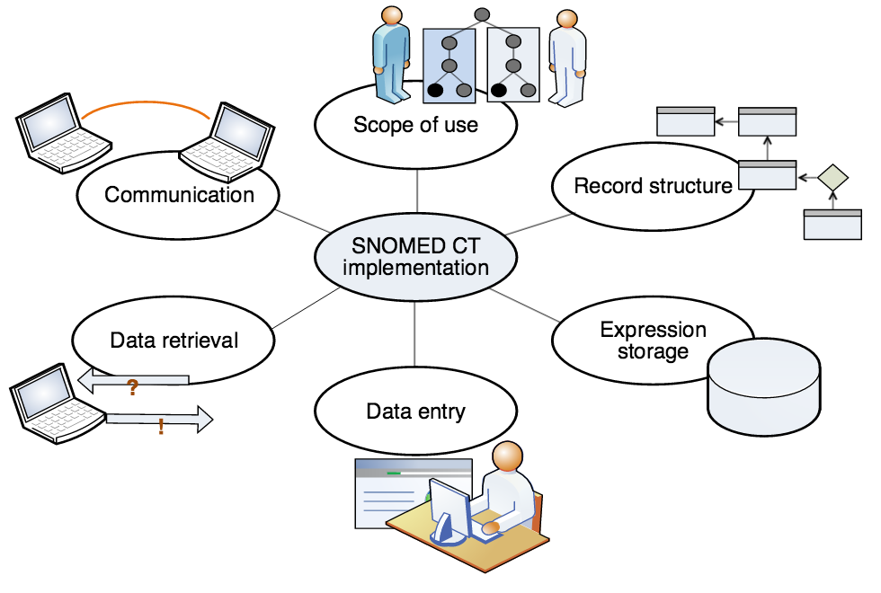

# 8. SNOMED CT Implementation

This section provides an overview of: 

  * How is SNOMED CT used?
  * Implementation Examples
    * Clinical Record Applications
    * Clinical Decision Support
    * Enabling Interoperability
    * Reporting
  * SNOMED CT in action

## Why is this important?

Realization of the benefits described in Chapter 2 - SNOMED CT Benefits, depends on using the terminology in software applications. The extent of benefits realization depends on the effectiveness of implementation and the way SNOMED CT is used within the system and by users and organizations.

## What is this?

### How is SNOMED CT Used?

SNOMED CT itself is only a part of the solution to addressing the requirements for effective electronic clinical records. A terminology on its own 'does nothing'. To benefit from a terminology, it must be implemented and used as part of an application. The design of the software application in which it is used, and the objectives and motivation of its users, are key factors in determining success.

SNOMED CT is useful for clinical documentation, as it supports the representation of detailed clinical information, in a way that can be processed automatically. Realization of the capability of SNOMED CT to support clinical information and meaning based retrieval requires careful consideration of the actual setting, in terms of scope of use, record structure, data entry, data retrieval and communication.

<figure></figure>

### Implementation Examples

#### Clinical Record Applications

SNOMED CT can be implemented in a wide range of clinical record applications. These include systems developed for use with other code systems that have been adapted to support SNOMED CT as well as systems designed with the assumption that SNOMED CT would serve as the primary terminology. The SNOMED CT features that applications support and use may vary, partly due to differences in user requirements and partly due to development priorities.

A terminological resource is only one part of a software application. The functions required to implement a terminology can be divided into:

  * Terminology services: Functions that can be performed without reference to data stored in a particular application record structure.
  * Record services: Functions that involve storing, retrieving or processing application data (e.g. patient health records).

Different applications may make use of different aspects of SNOMED CT. Applications that only require SNOMED CT for a very limited range of uses and may not require all the features of SNOMED CT. However, by using SNOMED CT, these applications benefit from an enhanced ability to exchange data with other more terminology rich applications. These applications can also evolve to meet emergent requirements by making increasing use of the power of SNOMED CT.

Most users only require a small subset of the content of SNOMED CT. However, use of a terminology that spans a wide range of specialties delivers the benefits that arise from consistency, and interoperability.

#### Clinical Decision Support

####  _How can the use of SNOMED CT assist in clinical decision support?_

Clinical decision support is defined broadly as a clinical system application or process that helps health professionals make clinical decisions to enhance patient care. An example of clinical decision support would be the use of alerts to identify specific clinical contraindications in the administration of thrombocytopenia therapy after a stroke.

The use of SNOMED CT makes clinical information available in a computable form which can be queried and used to trigger decision support rules and prompts. The hierarchies of SNOMED CT enable complex reasoning to support decision support rules. For example, in SNOMED CT the concept |stroke| is synonymous with |cerebrovascular accident| and subsumes all lower level concepts including |paralytic stroke|, |thrombotic stroke| etc. This means that decision support queries are easier to develop and implement because they do not need to identify all the individual terms and codes which may be relevant.

#### _Has it been implemented?_

Yes. SNOMED CT is known to be used for Clinical Decision Support in a number of organizations including Kaiser Permanente, Duke University Medical Hospital in the US; National Health Service Hospitals in the UK and Hospital Italiano in Buenos Aries, Argentina.

Kaiser Permanente has a central terminology service which develops and maintains clinical decision support rules and prompts. These can be quickly distributed for implementation throughout the organization. In addition to using this type of approach for clinical decision support, Kaiser Permanente also use it to identify potential cohorts for clinical trials etc.

#### Enabling Interoperability

####  _How can you ensure that clinical information entered in one context can be safely and accurately transmitted to another system in another context?_

Information can be recorded using SNOMED CT concepts and descriptions that are independent of the clinical information system being used and either independent of or tied to the context of use, depending on the user requirements. SNOMED CT is a common clinical terminology covering a wide range of requirements and its use. SNOMED CT allows meaning-based computation to be applied to information in messages sent between systems, and provides a foundation for interoperable interpretation of clinical information.

For example, subtype descendant concepts that may be relevant to prescribing decisions (e.g. |allergy to substance|, |kidney disease|) can be used to trigger alerts and reminders in the recipient system, such as medication allergy alerts and drug level investigation warnings. These preventative health care reminders, enable the quality of care to be improved.

#### _Has it been implemented?_

Yes. In the United States, Kaiser Permanente (KP), The Veterans Health Administration (VHA), and the Department of Defense (DoD) health systems currently interoperate using SNOMED CT. A consortium comprised of Kaiser Permanente, the Mayo Clinic, Intermountain Health Care, Geisinger Health System, and Group Health Cooperative of Puget Sound has announced they will interoperate using SNOMED CT and techniques established by KP, the VHA and DoD.

#### Reporting

####  _How can clinical information encoded as SNOMED CT concepts be used for reporting purposes?_

Information encoded as SNOMED CT concepts is semantically consistent. In other words, there is one unique SNOMED CT identifier representing each separate meaning. This lends itself to reporting through specifying the SNOMED CT identifiers of interest. SNOMED CT supports recording at appropriate levels of detail and using relevant terms. This also means that reports can be generated at the appropriate levels of detail using relevant terms for display in the report.

The hierarchical nature of SNOMED CT means that information can be aggregated at the appropriate levels of generalization. That same information can also be used in reporting to provide the same level of detail. SNOMED CT is a common clinical terminology covering a wide range of requirements and supporting a wide variety of use cases for reporting, including patient care, clinical audit, quality improvement, outcomes, epidemiology, patient safety, etc. As SNOMED CT is a clinical terminology with a global scope, reports using SNOMED CT can be compared across boundaries.

Where required, SNOMED CT may also be mapped to other code systems and classifications to support existing reporting requirements.

#### _Has it been implemented?_

Yes, many clinical information systems use SNOMED CT to varying degrees and many standards mandate or recommend that SNOMED CT be used. Such cases include reports sent using HL7 messages, microbiology results reporting, and genetic database reports.

#### Other examples of SNOMED CT in action

You can see other examples of implementations using SNOMED CT in a dynamically maintained list at <https://www.snomed.org/snomed-in-action>. This site also allows you to add summaries of implementations that you are involved in.
